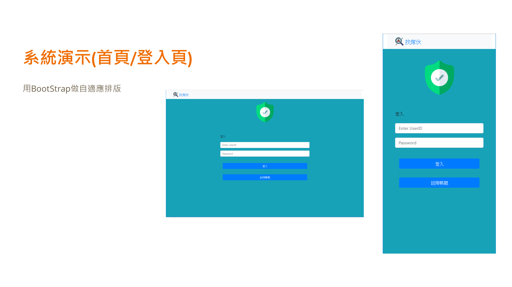
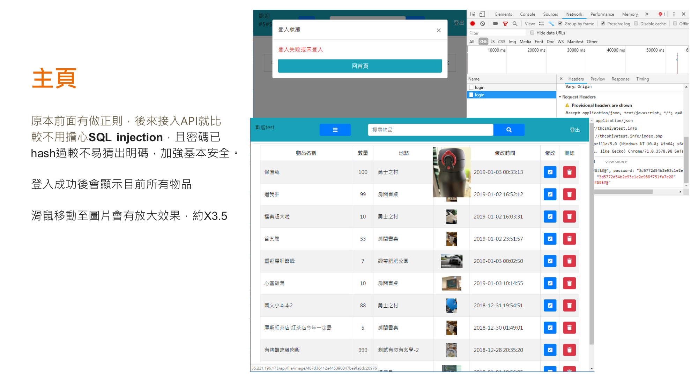
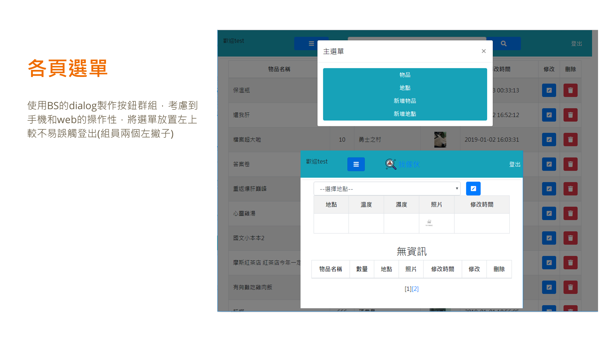
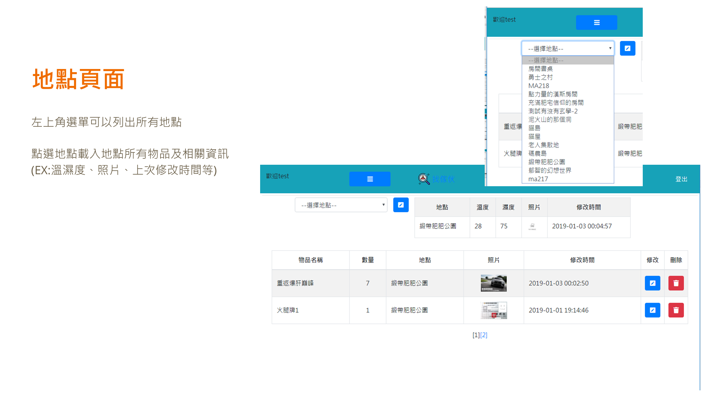
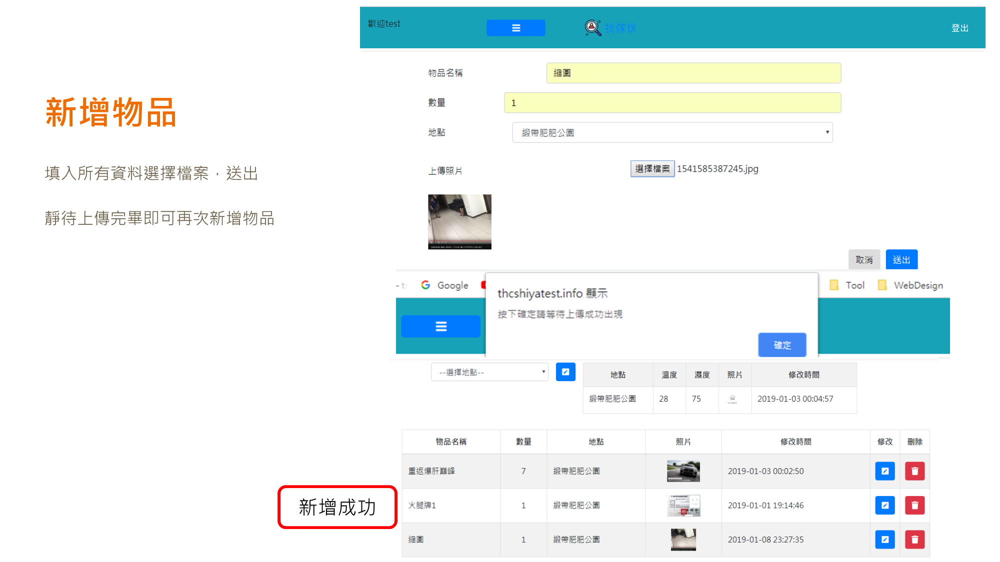
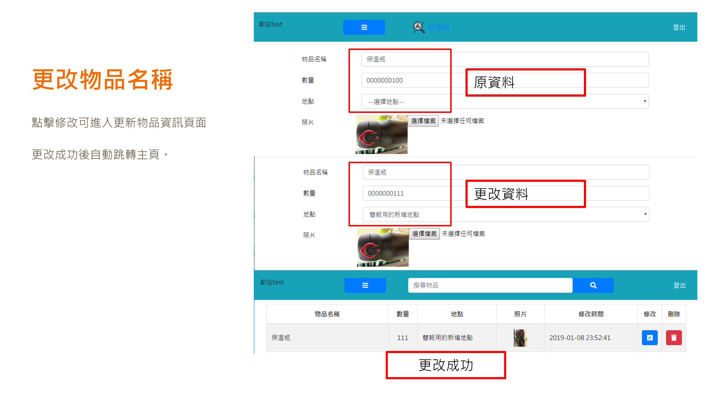
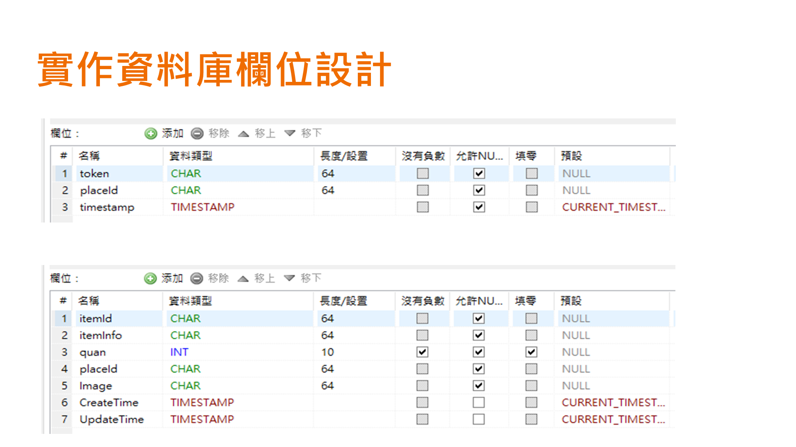
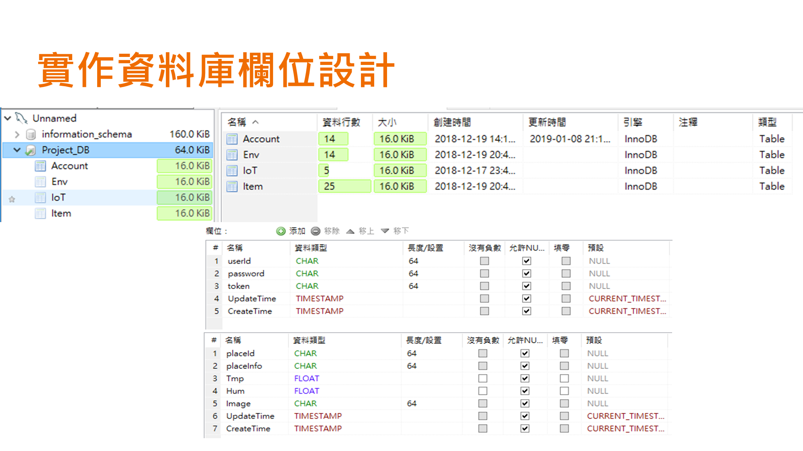

## Restful & IOS app  on group project @ DB class

### 整個專案全貌

---

可以透過網頁或是專用的IOS app，尋找物品/新增物品/透過QR 尋找物品等等

類似市場上有的倉管服務

在我的部分，製作了IOS前端(Swift)以及Restful後端

在這份git中，提供了Restful的部分

---

#### 關於這份作業

為了資料庫課程期末小組專案，在一個樣板code加入了一些擴充功能

* 在網頁管理介面能修改物品圖片等資料
* 可以在網頁管理介面查看圖片
* 可以在網路管理介面快速產生該物品/地點的QR code

* 在IOS App上可以快速的新增商品/修改/拍照/掃描

前端 : php / IOS

後端 : php / Restful

## Restful server  (Flask)

1. 簡單註冊登入
2. 查詢/新增物品
3. 修改物品 (e.g. 數量)
4. QR code 產生
5. 自動縮小圖片以及透過EXIF旋轉圖片並輸出
6. 圖片伺服器

### IOS app

---

Swift 4

順暢的table view / 拍照/ 照片處理 /QR 掃描/

例外寫好寫滿，不crash，不死回圈不耗電

困難/麻煩的部分都透過第三方套件完成

token 儲存 / 圖片 自動緩存 / Alamofire   / Json 處理

### Simple demo

---

more demo : [demo video(youtube)](https://youtu.be/X8byGabslxY)

---

Scan QR to search item or place.

---

Search by place name

---

Search by text

---

Restful/IOS 我製作的部分

整個專案包含我，共三位製作

已知缺點: restful 因沒有要跟人協作， 我不是註解派的，命名些微糟

code 不乾淨請見諒 ， flask 用 global 好像不是好方法，應該用__init.py 才是

token應該要從cookie帶才對，這裡放在資料中

## php section
### Overview
---
本作品在Web端的部分由tsenghc及另一位同學共同製作

不過因為伺服器已經關閉，故改用簡報圖片概述，沒有留下操作影片請見諒

---

#### 首頁
---
很簡單的登入及註冊

最初版本直接用php存取DB，在API開好之後，改用Ajax的方式向API取得帳密資料

---

#### 主頁
---

進入主頁一目瞭然的各種物品資訊

---

#### 簡單帶過選單
---

---
### 各式新刪改查應用

#### 地點
---

---

#### 新增物品/更改物品資訊
---

---

## Overview of Database 
---
紀錄一下，給以後的的自己笑笑:D

---
